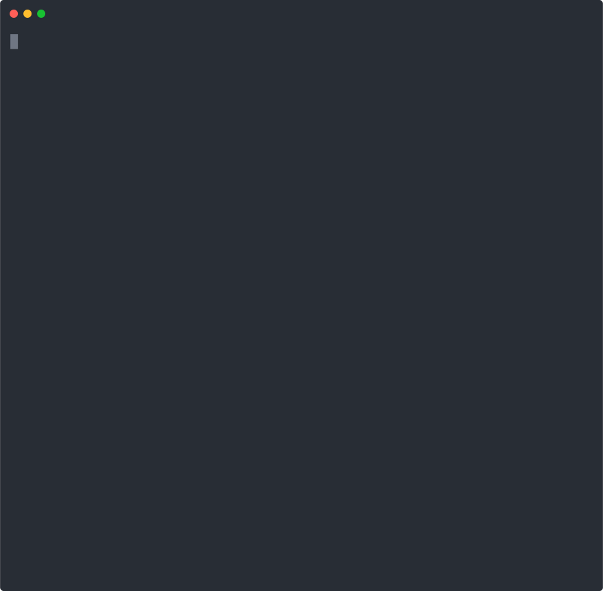

> Multi-threaded batch processing and background jobs for .NET Core

Runly is a framework for simplifying complex applications by writing compartmentalized, testable code. You focus on writing your business logic and Runly gives you a CLI, multi-threading, retries, and more out-of-the-box.



## How Does It Work?

You build your jobs as classes that inherit from `Job` into a new console app. You reference the [`Runly` nuget package](https://www.nuget.org/packages/Runly/) and you immediately have a fully functioning and robust CLI app.

## :rocket: Get Started

There are two ways to bootstrap a Runly job app:

1. Create a new job app from the [GitHub template](https://github.com/runlyio/template-dotnet). This will create a new repository for you that you can clone and immediately start running.

2. Skip the Git repo and create a local app via the `dotnet new` template:

First, install the template:

```
dotnet new -i Runly.Templates
```

Then create a new project:

```
mkdir myproject
cd myproject
dotnet new runly-app
```

That's it - you can now start running! Learn more about how to build jobs in the [Runly Quickstart](https://www.runly.io/docs/net/start/).

## Example

Here is a job that reads a CSV file (using [CsvHelper](https://joshclose.github.io/CsvHelper/)) and sends an email to each person in the file.

```c#
public class CsvEmailer : Job<CsvConfig, Person>
{
    readonly MyEmailService emails;

    public CsvEmailer(CsvConfig config, MyEmailService emails)
        : base(config)
    {
        this.emails = emails;
    }

    public override IAsyncEnumerable<Person> GetItemsAsync()
    {
        // Return a list of items to process.
        // In this case, we will stream CSV records from a file.

        var csv = new CsvReader(File.Open(Config.CsvFilePath), CultureInfo.InvariantCulture);
        csv.Configuration.Delimiter = "|";

        return csv.GetRecordsAsync<Person>();
    }

    public override async Task<Result> ProcessAsync(Person person)
    {
        // Do the work to process each item.

        await emails.SendReminderEmail(person.Email, person.Name)
        return Result.Success();
    }
}
```

Using command line flags or JSON config, this can then easily be multi-threaded to send multiple emails at a time and allow for retries to deal with intermittent errors while sending the email.

See [more in-depth examples](./examples) or [start reading the docs](https://www.runly.io/docs/net/).

## Why Write Code Like This?

A lot of problems that developers are tasked with solving everyday boil down to processing lists of items. Some examples could be:

* importing and processing records from large files into a database
* downloading or uploading import/export files on a schedule automatically
* queueing and sending large amounts of transactional emails
* generating PDFs from a list of records in a database
* handling ETL scenarios

A Runly job takes this pattern and standardizes it into a base `Job` class. Building and running jobs in a predictable way like this allows us to build lots of goodies on top of your core jobs. Things like multi-threading, scaling work across different machines, and resiliency and fault-tolerance become almost trivial for you to implement.

In fact, we have done exactly that and built a whole platform on top of this core OSS project.

## The Runly Platform

You can turbocharge your job apps using the [Runly Platform](https://www.runly.io/platform/). The Runly Platform is SaaS which helps shepherd your jobs from deployment to monitoring and scaling in production.

* Automatically deploy your jobs to your existing machines or the cloud as NuGet packages using tools you already know and love.
* Use familiar REST concepts to queue and schedule background jobs from your web or mobile app.
* Easily integrate progress bars and job status into your app using [Runly UI](https://www.runly.io/ui/).
* Use CRON expressions for fine-grained control of job scheduling.
* Get insights into job failures and performance issues before your users notice.

You can get started on a [generous free tier](https://www.runly.io/pricing/) with no commitment and no credit card. [Get started for free using your GitHub account](https://www.runly.io/dashboard/) or learn more about [how it works](https://www.runly.io/docs/platform/).

## Is this project sustainable?

[Sustainability in OSS is a problem](https://twitter.com/UdiDahan/status/1282925432166285312). We are working on this project full-time and in order to keep doing that, we have to feed our families. We think providing value via a paid service is the best way to do that while still solving problems for people with the core OSS offering.

We are fiercely independent and not going anywhere. [Read more about our philosophy](https://www.runly.io/about/).

Our mission is to create great developer experiences by making it trivial to build and scale jobs in order to provide a great user experience in your app. We have plenty of ideas on how to do this but we need your support to continue working on this project.

You can support us by building a Runly job and letting us know what you think ([tweet @ us](https://twitter.com/runlyio) or [open an issue](https://github.com/runlyio/core-dotnet/issues/new)). If you find value in building Runly jobs, you can [give the Runly Platform a try](https://www.runly.io/platform/).

Or, just give us a GitHub star while you are here. It allows us to brag about all the internet points we are getting when our family asks what we are doing all day :wink:.

You can keep up with what we are working on by [following us on Twitter](https://twitter.com/runlyio).

--------------------------------------------------------

## Consuming Pre-release Packages

Pre-release packages are published to this project's [GitHub Packages Feed](https://github.com/runlyio/core-dotnet/packages). If you want to consume one of these pre-release packages for testing purposes, you can add a `nuget.config` file to the root of your project:

```xml
<?xml version="1.0" encoding="utf-8"?>
<configuration>
  <packageSources>
    <clear />
    <add key="github" value="https://nuget.pkg.github.com/runlyio/index.json" />
    <add key="NuGet.org" value="https://api.nuget.org/v3/index.json" />
  </packageSources>
  <packageSourceCredentials>
    <github>
      <add key="Username" value="USERNAME" />
      <add key="ClearTextPassword" value="PERSONAL_ACCESS_TOKEN" />
    </github>
  </packageSourceCredentials>
</configuration>
```

This config file will instruct your nuget client to look for packages via Runly's pre-release feed first and then the official NuGet feed.

You will need to authenticate to the GitHub feed using a [personal access token](https://github.com/settings/tokens/new). Generate a new token with the `read:packages` scope and replace `USERNAME` and `PERSONAL_ACCESS_TOKEN` in `nuget.config` with your values.
